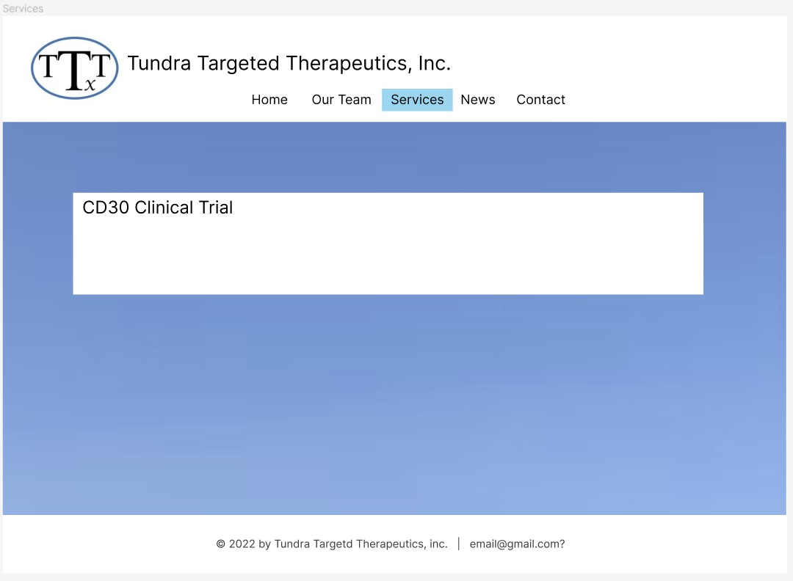
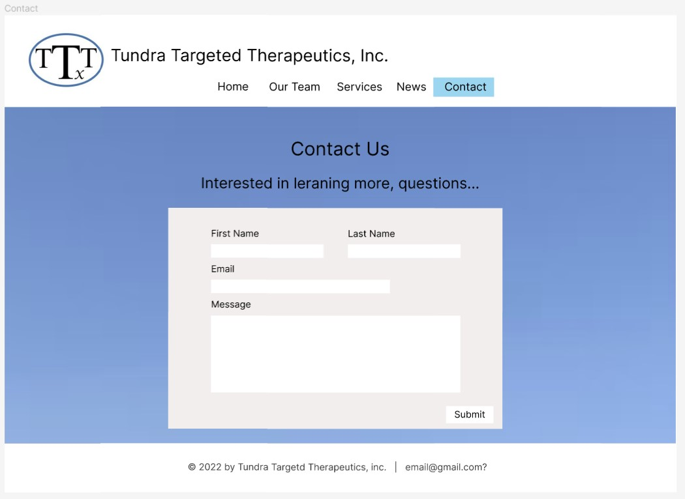

# Tundra Targeted Therapeutics Site

This project was a simple site mock-up for a start-up based on Figma wire frames (see below). My aim with this project was to learn and practice with Next.js and TypeScript. I used Next.js, TypeScript, Node.js, TailwindCSS, and example data read from json files using fs for coding this application.

Not compatible with all screen types.

[Hosted Site](https://tundra-targeted-therapeutics.herokuapp.com/)

# Technology

- Next.JS
- Node.js
- TypeScript
- TailwindCSS

# Wireframes

Home Page

Our Team Page

Services Page

News Page

Contact Page

